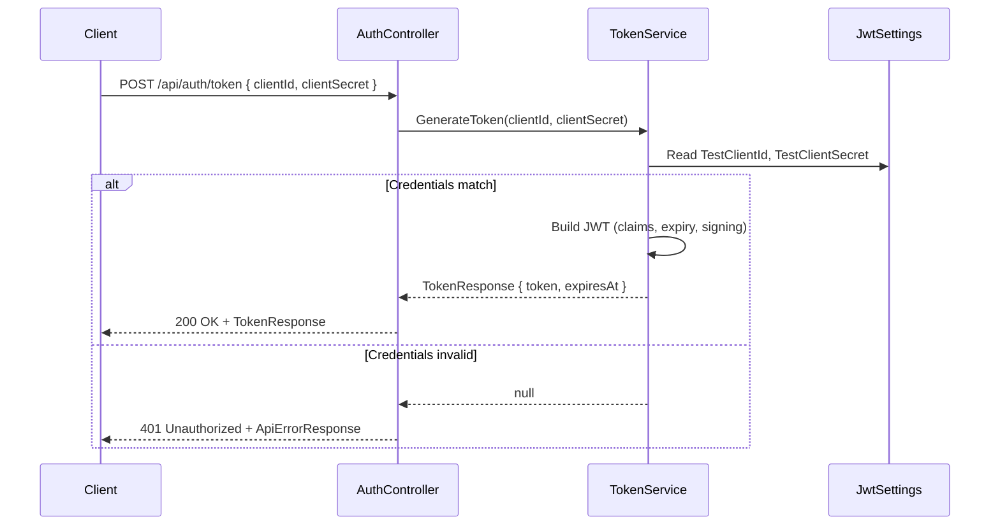
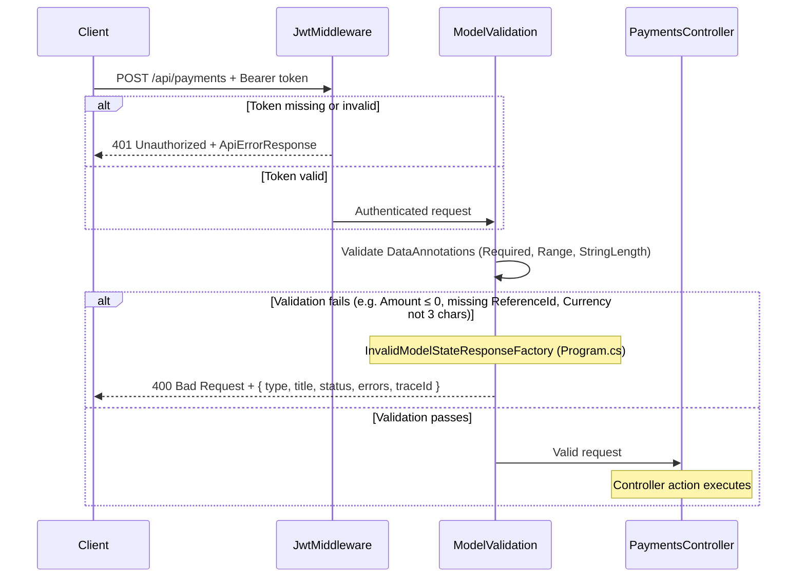
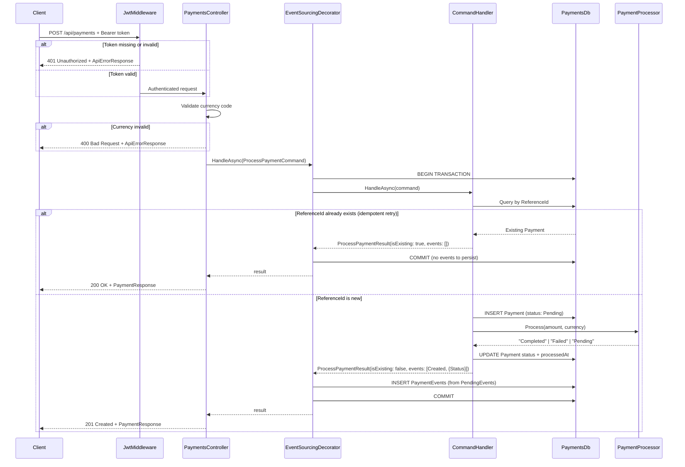
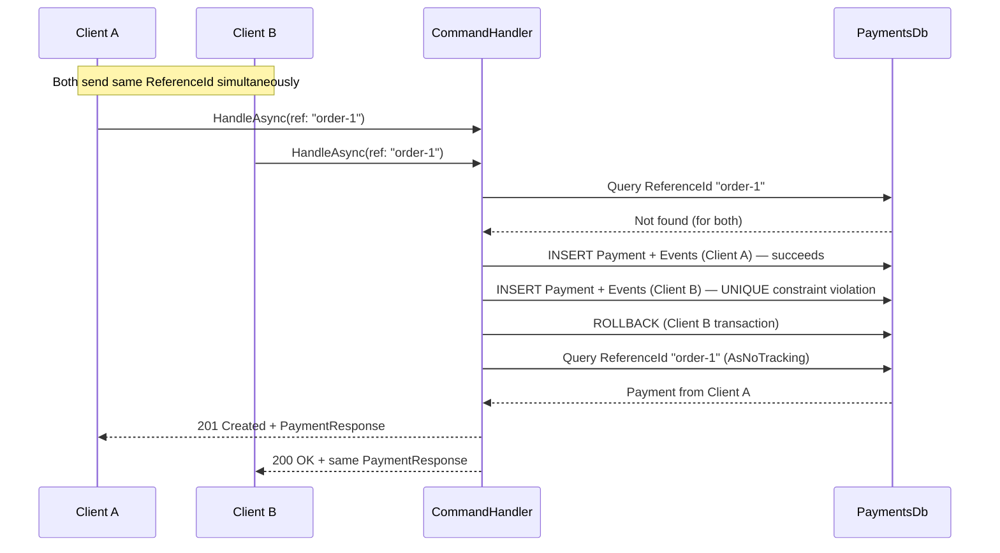
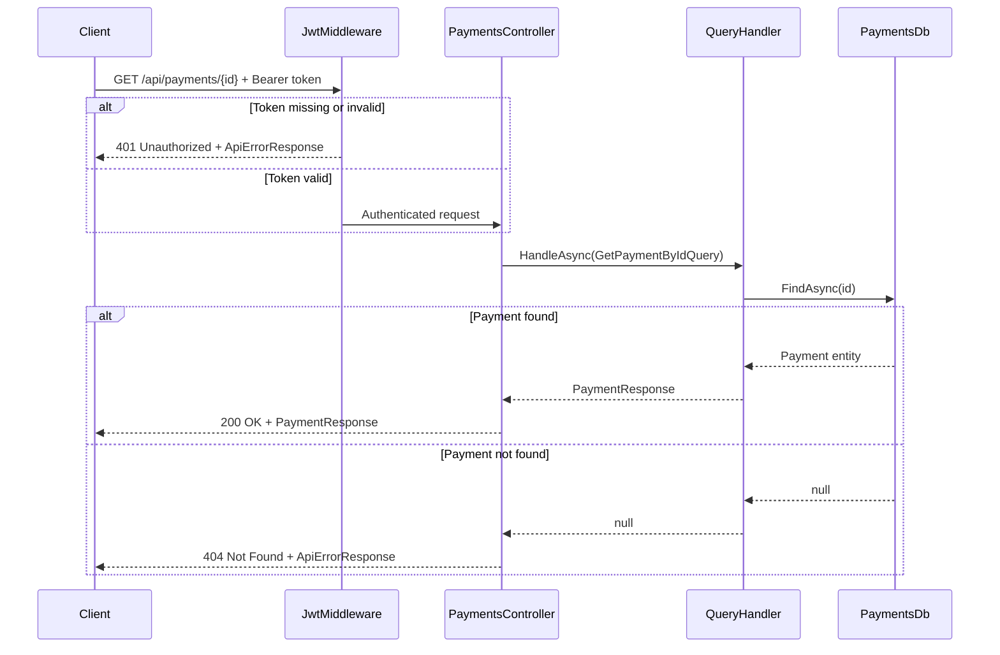
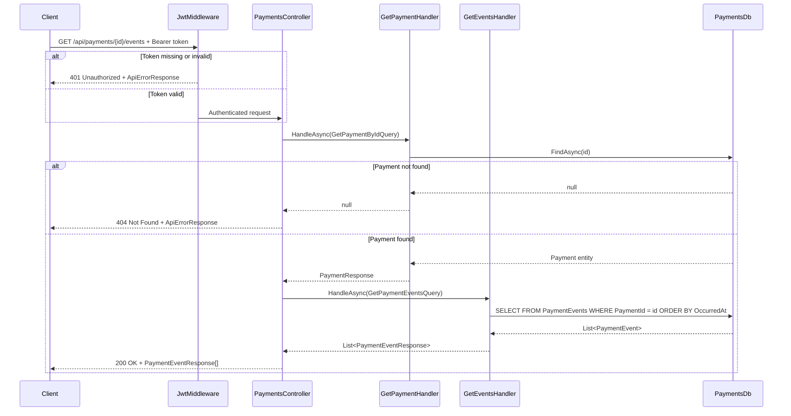
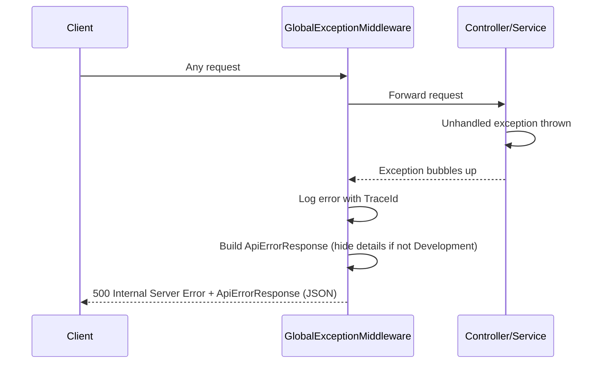

# Sequence Diagrams

## POST /api/auth/token

---

## POST /api/payments (Model Validation Failure)

---

## POST /api/payments (New Payment)

---

## POST /api/payments (Concurrent Race Condition)

---

## GET /api/payments/{id}

---

## GET /api/payments/{id}/events

---

## Unhandled Exception Flow

